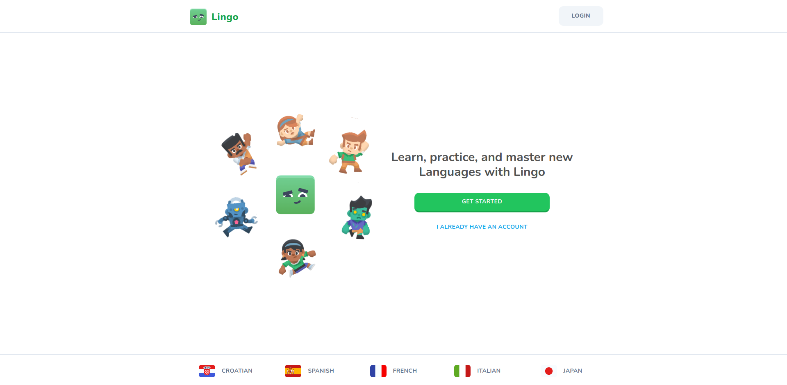

# Duolingo Clone

This is a duolingo Clone. This version is called Lingo. It teaches French, Spanish, Italian, Japanese & Croatian

## Technologies

- Next.js 14
- React.js
- Drizzle
- Clerck (Authentication)

## How to run

- git clone
- cd duolingo-clone
- npm install
- npm run dev
